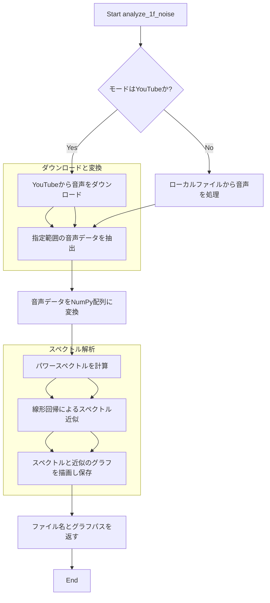
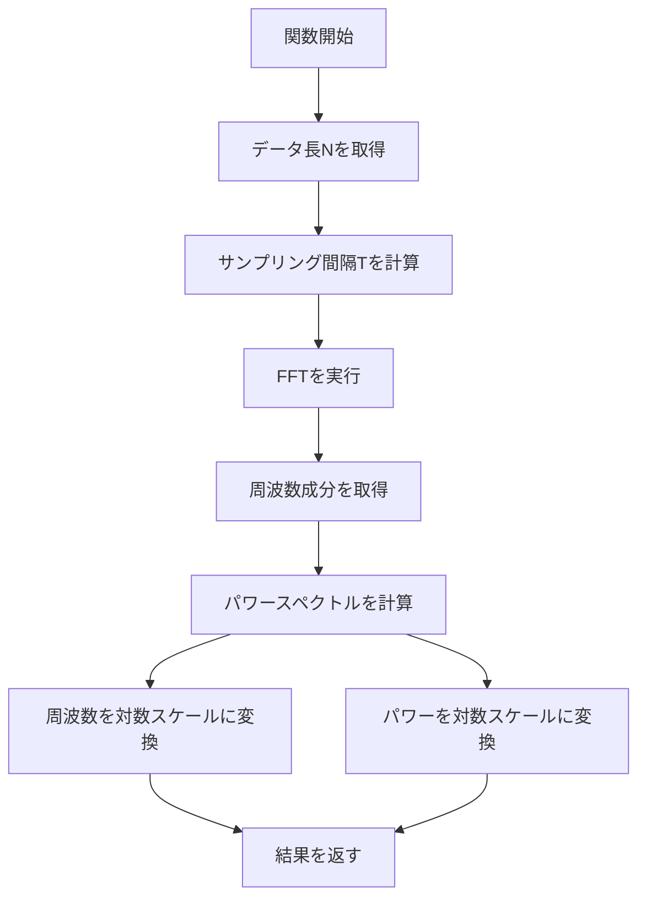
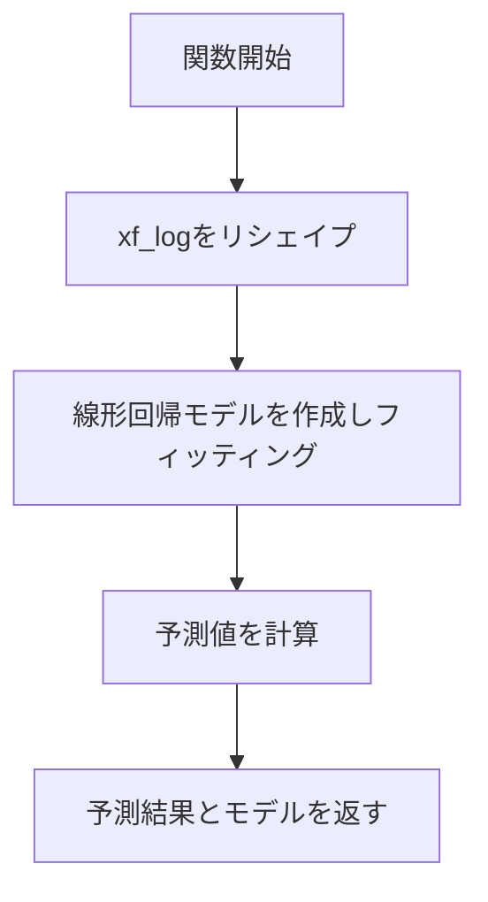

# 1/F揺らぎアナライザ

## 全体フローチャート

```mermaid
flowchart TD
    A[Start analyze_1f_noise] --> B{モードはYouTubeか?}
    B -- Yes --> C[YouTubeから音声をダウンロード] --> D[指定範囲の音声データを抽出]
    B -- No --> E[ローカルファイルから音声を処理] --> D
    
    D --> F[音声データをNumPy配列に変換]
    F --> G[パワースペクトルを計算]
    G --> H[線形回帰によるスペクトル近似]
    H --> I[スペクトルと近似のグラフを描画し保存]
    I --> J[ファイル名とグラフパスを返す]
    J --> K[End]

    subgraph ダウンロードと変換
        C --> D
    end

    subgraph スペクトル解析
        G --> H
        H --> I
    end
```

## パワースペクトル計算フローチャート

```mermaid
flowchart TD
    A[関数開始] --> B[データ長Nを取得]
    B --> C[サンプリング間隔Tを計算]
    C --> D[FFTを実行]
    D --> E[周波数成分を取得]
    E --> F[パワースペクトルを計算]
    F --> G[周波数を対数スケールに変換]
    F --> H[パワーを対数スケールに変換]
    G --> I[結果を返す]
    H --> I
```

## 線形回帰によるスペクトル近似のフローチャート

```mermaid
flowchart TD
    A[関数開始] --> B[xf_logをリシェイプ]
    B --> C[線形回帰モデルを作成しフィッティング]
    C --> D[予測値を計算]
    D --> E[予測結果とモデルを返す]
```