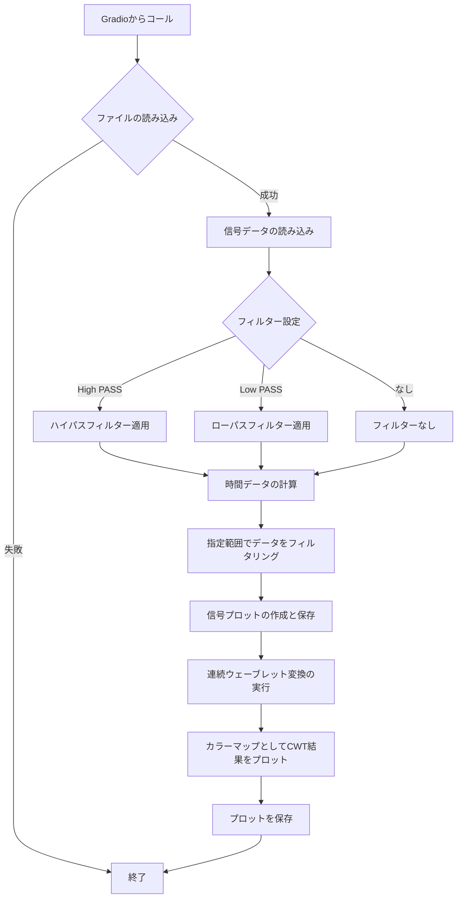

# ウェーブレット変換

## フローチャート

```mermaid
flowchart TD    
    A[Gradioからコール] --> F{ファイルの読み込み}
    F -->|成功| G[信号データの読み込み]
    F -->|失敗| Z[終了]
    
    G --> H{フィルター設定}
    H -->|High PASS| I[ハイパスフィルター適用]
    H -->|Low PASS| J[ローパスフィルター適用]
    H -->|なし| K[フィルターなし]
    
    I --> L[時間データの計算]
    J --> L
    K --> L
    
    L --> M[指定範囲でデータをフィルタリング]
    M --> N[信号プロットの作成と保存]
    
    N --> O[連続ウェーブレット変換の実行]
    O --> P[カラーマップとしてCWT結果をプロット]
    P --> Q[プロットを保存]
    Q --> Z[終了]
```
